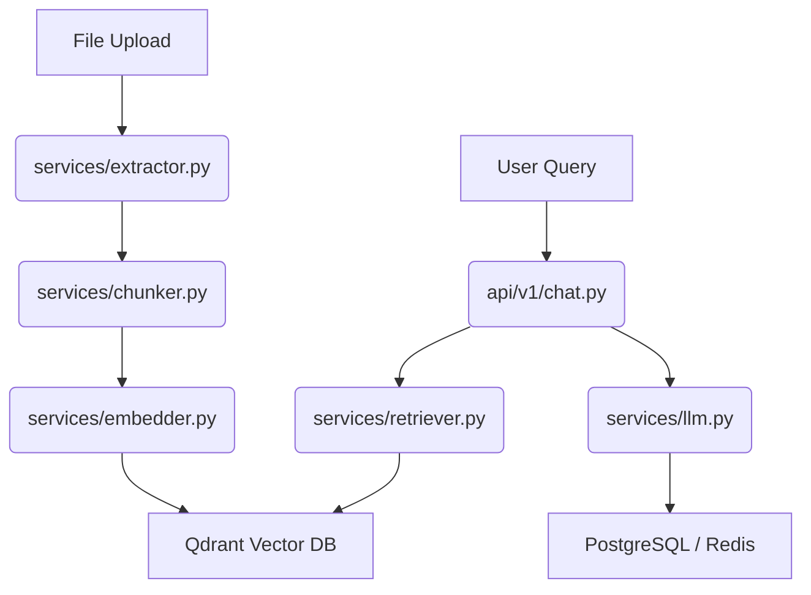

# Document RAG Backend

Two FastAPI services backing a document-aware chatbot:

1. **Document Ingestion API** — upload a PDF/TXT, extract text, chunk it
   (two selectable strategies), embed the chunks, store vectors in **Qdrant**
   and metadata in **PostgreSQL**.
2. **Conversational RAG API** — multi-turn chat over the ingested documents,
   backed by **Redis** chat memory, with a built-in LLM-driven interview
   booking flow (name / email / date / time), persisted to PostgreSQL.

No LangChain, no `RetrievalQAChain`, no FAISS/Chroma. Retrieval and prompt
assembly are written out by hand in `services/retriever.py` and
`services/llm.py` so the whole RAG loop is auditable in plain Python.

## Architecture


### Chunking strategies

- **`fixed`** — sliding character window (`chunk_size`, `chunk_overlap`).
  Simple, deterministic, fast.
- **`semantic`** — sentence-tokenize (NLTK), embed each sentence with a small
  local model, walk adjacent-sentence cosine similarity, cut where similarity
  drops below `semantic_similarity_threshold`. Produces topically coherent
  chunks at the cost of an extra embedding pass.

Selected per-request via the `strategy` form field on `/api/v1/ingest`.

### Conversational RAG flow

Each `POST /api/v1/chat` call:

1. Loads chat history + booking state for `session_id` from Redis.
2. If a booking flow is in progress, **or** the message matches a booking
   intent (`"book an interview"`, `"schedule a call"`, etc.), routes to the
   booking-extraction path: one OpenAI tool-calling request extracts any new
   slots (name/email/date/time) and drafts the reply in the same call.
   Once all four slots are present, `services/booking.py` validates and
   normalizes them; on success the booking is written to PostgreSQL.
3. Otherwise: embed the query, retrieve top-k chunks from Qdrant
   (`services/retriever.py`), and generate a grounded answer with a manually
   constructed prompt (`services/llm.py`) — the chat history is included so
   follow-up questions ("what about the second one?") resolve correctly.
4. Both the user message and the assistant's reply are appended to Redis
   history (trimmed to `CHAT_HISTORY_MAX_MESSAGES`, with a TTL).

## Setup

```bash
git clone <your-repo-url>
cd document-rag-backend
python -m venv .venv && source .venv/bin/activate
pip install -r requirements.txt
cp .env.example .env   # fill in OPENAI_API_KEY at minimum
```

Start the supporting services (Qdrant, PostgreSQL, Redis):

```bash
docker compose up -d
```

Run the app:

```bash
uvicorn main:app --reload
```

Open `http://localhost:8000/docs` for interactive Swagger docs.

## Usage examples

**Ingest a document:**

```bash
curl -X POST http://localhost:8000/api/v1/ingest \
  -F "file=@/path/to/handbook.pdf" \
  -F "strategy=semantic" \
  -F "chunk_size=500" \
  -F "chunk_overlap=50"
```

**Ask a question:**

```bash
curl -X POST http://localhost:8000/api/v1/chat \
  -H "Content-Type: application/json" \
  -d '{"session_id": "demo-1", "message": "What does the handbook say about leave policy?"}'
```

**Book an interview (multi-turn):**

```bash
curl -X POST http://localhost:8000/api/v1/chat \
  -d '{"session_id": "demo-1", "message": "I would like to schedule an interview"}'
# -> assistant asks for name/email/date/time

curl -X POST http://localhost:8000/api/v1/chat \
  -d '{"session_id": "demo-1", "message": "Alish Karki, alish@example.com, next Friday at 3pm"}'
# -> all slots present, booking validated and confirmed
```

## Testing

```bash
pytest
```

`tests/` covers the deterministic, dependency-free logic (fixed chunking,
TXT extraction, booking validation) without requiring Qdrant/Postgres/Redis
to be running.

## Notes / design tradeoffs

- **Embeddings provider** is swappable (`EMBEDDING_PROVIDER=local|openai`)
  without touching calling code — `Embedder` hides the choice behind one
  interface. Local is the default so the project runs with zero paid APIs
  except for the chat LLM itself.
- **Chat LLM provider** is also swappable (`LLM_PROVIDER=openai|ollama`).
  Ollama exposes an OpenAI-compatible `/v1/chat/completions` endpoint, so
  `LLMService` talks to it through the same `openai` SDK with a different
  `base_url` — install [Ollama](https://ollama.com), run `ollama pull llama3.1`,
  set `LLM_PROVIDER=ollama` in `.env`, and the whole app (including the
  tool-calling booking flow) runs with zero paid APIs and no internet
  dependency.
- **Booking intent detection** uses a cheap regex heuristic rather than an
  LLM call, to avoid burning a model call on every single chat turn just to
  classify intent; the LLM is reserved for the actual slot extraction, where
  it earns its cost.
- **Chunk text is duplicated** into both Qdrant payloads and the
  `chunk_metadata` Postgres table. This trades a small amount of storage for
  zero-round-trip retrieval and easy auditing/re-indexing from SQL alone.
